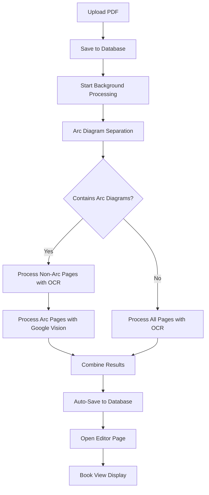
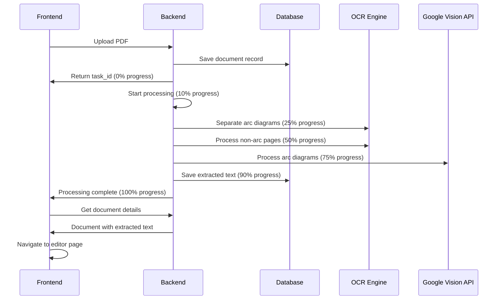

# UI Improvement and Bug Fix Design

## Overview
This document outlines the design for improving the OCR application's user interface and fixing critical bugs identified in the current implementation. The focus is on enhancing the document processing workflow, implementing proper progress tracking, creating a book-view layout for document validation, and ensuring proper database persistence.

## Current Issues Analysis

### 1. Workflow Discrepancy
**Issue**: The current application workflow does not fully align with the specification in `workflow_prompt.txt`
- Current workflow lacks proper arc diagram separation before text extraction
- Progress tracking shows 100% completion before actual processing finishes
- Missing real-time progress updates during backend processing

### 2. Editor Page UI Problems
**Issue**: The editor page layout is not user-friendly for document validation
- Lacks proper book-view layout for side-by-side comparison
- Original document preview not properly displayed alongside extracted text
- Poor visual layout for document validation workflow

### 3. Progress Tracking Issues
**Issue**: Misleading progress indicators during document upload and processing
- Progress jumps to 100% before backend processing completion
- No live backend processing status updates
- User cannot track actual OCR processing stages

### 4. Database Persistence Issues
**Issue**: Document save functionality is not working correctly
- Save button functionality broken
- Documents not properly saved to database after text extraction
- Missing auto-save functionality after extraction completion

## Architecture Improvements

### Document Processing Workflow Enhancement



### Progress Tracking System



## UI Component Redesign

### 1. Enhanced Processing View

**Current Problems**:
- Progress calculation jumps to 100% prematurely
- No detailed stage-specific progress indicators
- Missing error recovery mechanisms

**Improved Design**:

```javascript
// Enhanced progress stages with accurate tracking
const processingStages = [
  { id: 'upload', label: 'Uploading File', progress: [0, 5] },
  { id: 'saving', label: 'Saving to Database', progress: [5, 10] },
  { id: 'analysis', label: 'Analyzing Document Structure', progress: [10, 25] },
  { id: 'separation', label: 'Separating Arc Diagrams', progress: [25, 35] },
  { id: 'ocr_processing', label: 'OCR Text Extraction', progress: [35, 65] },
  { id: 'vision_processing', label: 'Diagram Text Extraction', progress: [65, 85] },
  { id: 'combining', label: 'Combining Results', progress: [85, 95] },
  { id: 'finalizing', label: 'Finalizing and Saving', progress: [95, 100] }
];
```

### 2. Book View Text Editor

**Layout Structure**:

```
┌─────────────────────────────────────────────────────────┐
│                     Header Section                       │
│  Document Name | Progress | Search | Actions | Save     │
├─────────────────────────────────────────────────────────┤
│           Two-Page Book View Container                   │
│  ┌───────────────────┐  │  ┌───────────────────┐      │
│  │   Original Doc    │  │  │  Extracted Text   │      │
│  │   Preview Page    │  │  │     Editor        │      │
│  │                   │  │  │                   │      │
│  │  [Page Image]     │  │  │  [Editable Text]  │      │
│  │                   │  │  │                   │      │
│  │                   │  │  │                   │      │
│  └───────────────────┘  │  └───────────────────┘      │
├─────────────────────────────────────────────────────────┤
│              Page Navigation Controls                    │
│      ◀ Previous | Page 1 of 5 | Next ▶                │
└─────────────────────────────────────────────────────────┘
```

**Key Features**:
- Side-by-side original document and extracted text display
- Synchronized page navigation
- Real-time text editing with automatic saving
- Visual validation interface with highlighting

### 3. Auto-Save Implementation

**Save Strategy**:
- **Immediate Save**: After OCR processing completion
- **Interval Save**: Every 30 seconds during editing
- **Manual Save**: User-triggered save with Ctrl+S
- **Validation Save**: Before page navigation

## Backend Enhancements

### 1. Real-Time Progress Updates

**Progress Tracking System**:

```python
class ProgressTracker:
    def __init__(self, task_id):
        self.task_id = task_id
        self.stages = {
            'upload': {'min': 0, 'max': 5, 'message': 'Uploading file...'},
            'database_save': {'min': 5, 'max': 10, 'message': 'Saving to database...'},
            'analysis': {'min': 10, 'max': 25, 'message': 'Analyzing document structure...'},
            'separation': {'min': 25, 'max': 35, 'message': 'Separating arc diagrams...'},
            'ocr_processing': {'min': 35, 'max': 65, 'message': 'Extracting text from pages...'},
            'vision_processing': {'min': 65, 'max': 85, 'message': 'Processing diagrams...'},
            'combining': {'min': 85, 'max': 95, 'message': 'Combining results...'},
            'finalizing': {'min': 95, 'max': 100, 'message': 'Finalizing processing...'}
        }
    
    def update_progress(self, stage, sub_progress=0):
        """Update progress for a specific stage with sub-progress (0-1)"""
        if stage not in self.stages:
            return
            
        stage_info = self.stages[stage]
        progress_range = stage_info['max'] - stage_info['min']
        current_progress = stage_info['min'] + (progress_range * sub_progress)
        
        jobs[self.task_id]['progress'] = min(100, max(0, current_progress))
        jobs[self.task_id]['status_message'] = stage_info['message']
```

### 2. Enhanced Document Processing Workflow

**Workflow Implementation**:

```python
async def process_pdf_with_enhanced_tracking(task_id: str, file_path: str, filename: str):
    """Enhanced PDF processing with accurate progress tracking"""
    progress_tracker = ProgressTracker(task_id)
    
    try:
        # Stage 1: Database Save
        progress_tracker.update_progress('database_save', 0.0)
        document_id = await save_document_to_database(file_path, filename)
        progress_tracker.update_progress('database_save', 1.0)
        
        # Stage 2: Analysis
        progress_tracker.update_progress('analysis', 0.0)
        document_analysis = await analyze_document_structure(file_path)
        progress_tracker.update_progress('analysis', 1.0)
        
        # Stage 3: Arc Diagram Separation
        progress_tracker.update_progress('separation', 0.0)
        separation_result = await separate_arc_diagrams(file_path, progress_tracker)
        progress_tracker.update_progress('separation', 1.0)
        
        # Stage 4: Text Extraction (OCR)
        if separation_result['non_arc_pages'] > 0:
            progress_tracker.update_progress('ocr_processing', 0.0)
            ocr_result = await extract_text_from_pages(
                separation_result['non_arc_pdf'], 
                progress_tracker
            )
            progress_tracker.update_progress('ocr_processing', 1.0)
        
        # Stage 5: Vision API Processing
        if separation_result['arc_pages'] > 0:
            progress_tracker.update_progress('vision_processing', 0.0)
            vision_result = await extract_text_from_diagrams(
                separation_result['arc_pdf'], 
                progress_tracker
            )
            progress_tracker.update_progress('vision_processing', 1.0)
        
        # Stage 6: Combine Results
        progress_tracker.update_progress('combining', 0.0)
        combined_result = await combine_extraction_results(ocr_result, vision_result)
        progress_tracker.update_progress('combining', 1.0)
        
        # Stage 7: Final Save
        progress_tracker.update_progress('finalizing', 0.0)
        await save_extracted_content(document_id, combined_result)
        await save_document_pages_as_images(document_id, file_path)
        progress_tracker.update_progress('finalizing', 1.0)
        
        # Mark as completed
        jobs[task_id]['status'] = 'completed'
        jobs[task_id]['result'] = {
            'document_id': document_id,
            'extracted_text': combined_result['text'],
            'total_pages': combined_result['pages'],
            'processing_complete': True
        }
        
    except Exception as e:
        jobs[task_id]['status'] = 'failed'
        jobs[task_id]['error'] = str(e)
        logger.error(f"Processing failed for task {task_id}: {e}")
```

### 3. Document Persistence Layer

**Database Schema Enhancements**:

```sql
-- Enhanced documents table
CREATE TABLE IF NOT EXISTS documents (
    id UUID PRIMARY KEY,
    filename VARCHAR(255) NOT NULL,
    original_filename VARCHAR(255) NOT NULL,
    file_size BIGINT,
    file_path TEXT,
    processing_status VARCHAR(50) DEFAULT 'uploaded',
    total_pages INTEGER DEFAULT 0,
    upload_date TIMESTAMP DEFAULT CURRENT_TIMESTAMP,
    processing_start_time TIMESTAMP,
    processing_end_time TIMESTAMP,
    last_modified TIMESTAMP DEFAULT CURRENT_TIMESTAMP
);

-- Auto-save tracking table
CREATE TABLE IF NOT EXISTS document_versions (
    id UUID PRIMARY KEY,
    document_id UUID REFERENCES documents(id),
    version_number INTEGER,
    content TEXT,
    save_type VARCHAR(20), -- 'auto', 'manual', 'validation'
    created_at TIMESTAMP DEFAULT CURRENT_TIMESTAMP
);

-- Enhanced pages table with proper indexing
CREATE INDEX IF NOT EXISTS idx_pages_document_id ON pages(document_id);
CREATE INDEX IF NOT EXISTS idx_documents_status ON documents(processing_status);
```

## API Enhancements

### 1. Enhanced Task Status Endpoint

```python
@app.get("/task-status/{task_id}")
async def get_enhanced_task_status(task_id: str):
    """Enhanced task status with detailed progress information"""
    
    if task_id not in jobs:
        raise HTTPException(status_code=404, detail="Task not found")
    
    job = jobs[task_id]
    
    response = {
        "task_id": task_id,
        "status": job['status'],
        "progress": job.get('progress', 0),
        "status_message": job.get('status_message', ''),
        "created_at": job['created_at'],
        "estimated_time_remaining": calculate_time_remaining(job.get('progress', 0)),
        "current_stage": get_current_stage(job.get('progress', 0))
    }
    
    if job['status'] == 'completed':
        response['result'] = job['result']
        response['redirect_to'] = f"/editor/{job['result']['document_id']}"
    elif job['status'] == 'failed':
        response['error'] = job.get('error', 'Unknown error')
    
    return response
```

### 2. Auto-Save API Endpoint

```python
@app.post("/documents/{document_id}/auto-save")
async def auto_save_document(
    document_id: str, 
    content: str = Body(...),
    save_type: str = "auto"
):
    """Auto-save document content with version tracking"""
    
    try:
        # Validate document exists
        if not await document_exists(document_id):
            raise HTTPException(status_code=404, detail="Document not found")
        
        # Save new version
        version_id = await save_document_version(
            document_id=document_id,
            content=content,
            save_type=save_type
        )
        
        # Update document last_modified timestamp
        await update_document_timestamp(document_id)
        
        return {
            "success": True,
            "version_id": version_id,
            "saved_at": datetime.now().isoformat(),
            "save_type": save_type
        }
        
    except Exception as e:
        logger.error(f"Auto-save failed for document {document_id}: {e}")
        raise HTTPException(status_code=500, detail="Auto-save failed")
```

### 3. Enhanced Document Pages Endpoint

```python
@app.get("/documents/{document_id}/pages")
async def get_document_pages_enhanced(document_id: str):
    """Get document pages with proper error handling and caching"""
    
    try:
        # Validate document exists and is completed
        document = await get_document_by_id(document_id)
        if not document:
            raise HTTPException(status_code=404, detail="Document not found")
        
        if document['processing_status'] != 'completed':
            raise HTTPException(
                status_code=202, 
                detail="Document still processing"
            )
        
        # Get pages with base64 image data
        pages = await get_document_pages_with_images(document_id)
        
        return {
            "document_id": document_id,
            "total_pages": len(pages),
            "pages": [
                {
                    "page_number": page["page_number"],
                    "image_url": f"data:image/jpeg;base64,{page['image_base64']}",
                    "width": page.get("width"),
                    "height": page.get("height")
                }
                for page in pages
            ]
        }
        
    except HTTPException:
        raise
    except Exception as e:
        logger.error(f"Failed to get pages for document {document_id}: {e}")
        raise HTTPException(
            status_code=500, 
            detail="Failed to retrieve document pages"
        )
```

## Frontend Component Improvements

### 1. Enhanced Processing View Component

**Key Changes**:
- Real-time progress updates with WebSocket or polling
- Detailed stage information with estimated time remaining
- Error recovery and retry mechanisms
- Automatic navigation to editor upon completion

```javascript
const useProcessingStatus = (taskId) => {
  const [status, setStatus] = useState(null);
  const [error, setError] = useState(null);
  
  useEffect(() => {
    if (!taskId) return;
    
    const pollInterval = setInterval(async () => {
      try {
        const response = await apiService.getTaskStatus(taskId);
        setStatus(response);
        
        if (response.status === 'completed') {
          clearInterval(pollInterval);
          // Auto-navigate to editor
          if (response.redirect_to) {
            window.location.href = response.redirect_to;
          }
        } else if (response.status === 'failed') {
          clearInterval(pollInterval);
          setError(response.error);
        }
      } catch (err) {
        setError(err.message);
        clearInterval(pollInterval);
      }
    }, 2000); // Poll every 2 seconds
    
    return () => clearInterval(pollInterval);
  }, [taskId]);
  
  return { status, error };
};
```

### 2. Enhanced Text Editor with Auto-Save

**Auto-Save Implementation**:

```javascript
const useAutoSave = (documentId, content, enabled = true) => {
  const [lastSaved, setLastSaved] = useState(null);
  const [saving, setSaving] = useState(false);
  const [saveError, setSaveError] = useState(null);
  
  // Auto-save every 30 seconds
  useEffect(() => {
    if (!enabled || !documentId || !content) return;
    
    const autoSaveInterval = setInterval(async () => {
      try {
        setSaving(true);
        setSaveError(null);
        
        await apiService.autoSaveDocument(documentId, content, 'auto');
        setLastSaved(new Date());
      } catch (error) {
        setSaveError(error.message);
      } finally {
        setSaving(false);
      }
    }, 30000);
    
    return () => clearInterval(autoSaveInterval);
  }, [documentId, content, enabled]);
  
  // Manual save function
  const manualSave = async () => {
    try {
      setSaving(true);
      setSaveError(null);
      
      await apiService.autoSaveDocument(documentId, content, 'manual');
      setLastSaved(new Date());
      
      return { success: true };
    } catch (error) {
      setSaveError(error.message);
      return { success: false, error: error.message };
    } finally {
      setSaving(false);
    }
  };
  
  return { lastSaved, saving, saveError, manualSave };
};
```

### 3. Book View Layout Component

**Layout Structure**:

```javascript
const BookViewEditor = ({ document, extractedText, onTextChange }) => {
  const [currentPageIndex, setCurrentPageIndex] = useState(0);
  const [pages, setPages] = useState([]);
  const [loadingPages, setLoadingPages] = useState(false);
  
  const { lastSaved, saving, saveError, manualSave } = useAutoSave(
    document.id, 
    extractedText, 
    true
  );
  
  // Fetch document pages on mount
  useEffect(() => {
    if (document?.id) {
      fetchDocumentPages();
    }
  }, [document?.id]);
  
  const fetchDocumentPages = async () => {
    try {
      setLoadingPages(true);
      const pagesData = await apiService.getDocumentPages(document.id);
      setPages(pagesData.pages || []);
    } catch (error) {
      console.error('Failed to load pages:', error);
    } finally {
      setLoadingPages(false);
    }
  };
  
  return (
    <div className="book-view-container h-full flex flex-col">
      {/* Header with save status */}
      <BookViewHeader 
        document={document}
        saving={saving}
        lastSaved={lastSaved}
        saveError={saveError}
        onManualSave={manualSave}
      />
      
      {/* Two-page book layout */}
      <div className="flex-1 flex gap-6 p-6 bg-gray-50">
        {/* Left page - Original document */}
        <div className="flex-1 bg-white rounded-lg shadow-lg">
          <DocumentPageViewer 
            pages={pages}
            currentPageIndex={currentPageIndex}
            loading={loadingPages}
            onRetry={fetchDocumentPages}
          />
        </div>
        
        {/* Right page - Extracted text editor */}
        <div className="flex-1 bg-white rounded-lg shadow-lg">
          <TextContentEditor 
            content={extractedText}
            onChange={onTextChange}
            documentId={document.id}
            autoSave={true}
          />
        </div>
      </div>
      
      {/* Page navigation */}
      <BookViewNavigation 
        pages={pages}
        currentPageIndex={currentPageIndex}
        onPageChange={setCurrentPageIndex}
      />
    </div>
  );
};
```

## Testing Strategy

### 1. Frontend Component Testing

**Key Test Cases**:
- Progress tracking accuracy during document processing
- Auto-save functionality under various conditions
- Book view layout responsiveness and functionality
- Error handling and recovery mechanisms

### 2. Backend API Testing

**Integration Tests**:
- Document upload and processing workflow
- Progress tracking API accuracy
- Database persistence and retrieval
- Auto-save API reliability

### 3. End-to-End Testing

**User Workflow Tests**:
- Complete document upload to editor workflow
- Real-time progress tracking validation
- Document validation in book view
- Auto-save and manual save functionality